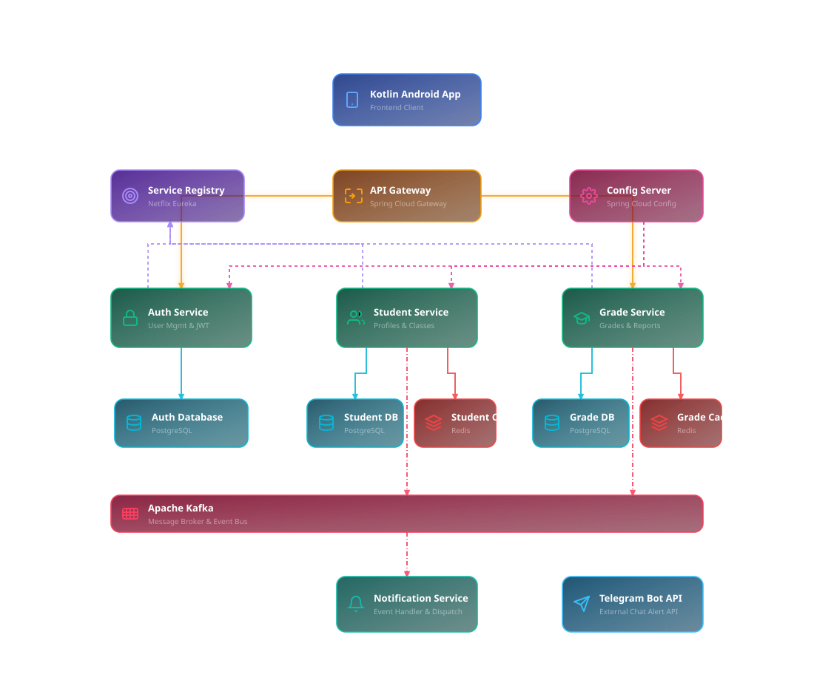

# Student Management System

A modern, full-stack student management application featuring a Jetpack Compose Android Frontend and a spring-boot-based microservices architecture backend.

---

## 🏗️ Microservices Architecture

Below is the design for the decomposed microservices architecture of this system, illustrating service boundaries, service discovery, centralized configuration, isolated databases, local caching, and event-driven notifications.



> 💡 **Edit the Diagram:** You can access the editable source file at [img/architecture.drawio](file:///c:/Users/USER/OneDrive/Desktop/student-app/img/architecture.drawio). Open [draw.io](https://draw.io) in your browser, select **Open Existing Diagram**, and select this file to make modifications.

---

### 🧩 System Components

1. **Frontend Client ([Frontend/](file:///c:/Users/USER/OneDrive/Desktop/student-app/Frontend))**:
   - An Android application built with Kotlin and Jetpack Compose.
   - Communicates with the backend services via standard HTTP/REST requests routed through the API Gateway.
2. **API Gateway (Spring Cloud Gateway)**:
   - Acts as the single entry point for all client requests.
   - Handles route matching (routing `/api/auth/**` to Auth Service, `/api/students/**` to Student Service, and `/api/grades/**` to Grade Service).
   - Manages global CORS, JWT signature validation, and rate limiting.
3. **Service Discovery Registry (Netflix Eureka)**:
   - Allows microservice instances to dynamically register themselves at startup.
   - Provides client-side load balancing and routing resolution for the API Gateway.
4. **Config Server (Spring Cloud Config)**:
   - Centralizes configuration parameters for all microservices in a git or filesystem repository, allowing dynamic updates.
5. **Auth Service ([com.studentmanagement.controller.AuthController](file:///c:/Users/USER/OneDrive/Desktop/student-app/backend/src/main/java/com/studentmanagement/controller/AuthController.java))**:
   - Manages user login, registration, password hashing, and token generation.
   - Communicates with an isolated PostgreSQL database (`auth_db`).
6. **Student Service ([com.studentmanagement.controller.StudentController](file:///c:/Users/USER/OneDrive/Desktop/student-app/backend/src/main/java/com/studentmanagement/controller/StudentController.java))**:
   - Handles CRUD operations for student records and class groupings.
   - Implements local caching with Redis for rapid reading of student profiles.
   - Persists data to an isolated PostgreSQL database (`student_db`).
7. **Grade Service ([com.studentmanagement.controller.GradeController](file:///c:/Users/USER/OneDrive/Desktop/student-app/backend/src/main/java/com/studentmanagement/controller/GradeController.java))**:
   - Handles course grading, exams, and student performance metrics.
   - Employs Redis caching for course analytics and grade reports.
   - Stores data in an isolated PostgreSQL database (`grade_db`).
8. **Notification Service**:
   - Consumes student and grade updates asynchronously from the message broker.
   - Formats alerts and publishes them to the external Telegram Bot API.
9. **Message Broker / Event Bus (Apache Kafka / RabbitMQ)**:
   - Enables decoupled, event-driven communication (e.g., `StudentCreatedEvent`, `GradePostedEvent`).
10. **Telegram Bot API (External Service)**:
    - Receives HTTP POST notifications from the Notification Service to alert teachers/admins in real-time.

---

## 🚀 Getting Started

### Prerequisites
Make sure you have the following installed:
- **Java Development Kit (JDK) 17** or higher.
- **Docker** and **Docker Compose**.
- **Android Studio** (for building the Kotlin Frontend).

### 1. Run the Infrastructure (Databases & Caches)
The backend system depends on PostgreSQL and Redis. Start them in the background using Docker Compose:

```bash
# Navigate to the backend directory
cd backend

# Start Postgres and Redis services
docker-compose up -d
```
> 🗄️ *The docker compose environment initiates PostgreSQL on port `5432` and Redis on port `6379` (with password protection).*

### 2. Run the Backend Application
For convenience, a script [backend/run.ps1](file:///c:/Users/USER/OneDrive/Desktop/student-app/backend/run.ps1) is provided to download Maven locally and run the application:

```powershell
# Navigate to the backend directory and execute the script
cd backend
./run.ps1
```

### 3. Run the Frontend Application
1. Open the [Frontend](file:///c:/Users/USER/OneDrive/Desktop/student-app/Frontend) folder in **Android Studio**.
2. Sync the Gradle project dependencies.
3. Select an emulator or connected physical Android device.
4. Click **Run** to compile and start the mobile client.
